# Diagram Tests

Test file for Mermaid diagram rendering.

## Flowchart

```mermaid
flowchart TD
    A([Open .md file]) --> B{Extension active?}
    B -- No --> C[Show raw text]
    B -- Yes --> D[Fetch content via background]
    D --> E[Parse frontmatter]
    E --> F[Render markdown]
    F --> G[Highlight code blocks]
    G --> H[Extract headings]
    H --> I([Show three-panel layout])
```

## Sequence Diagram

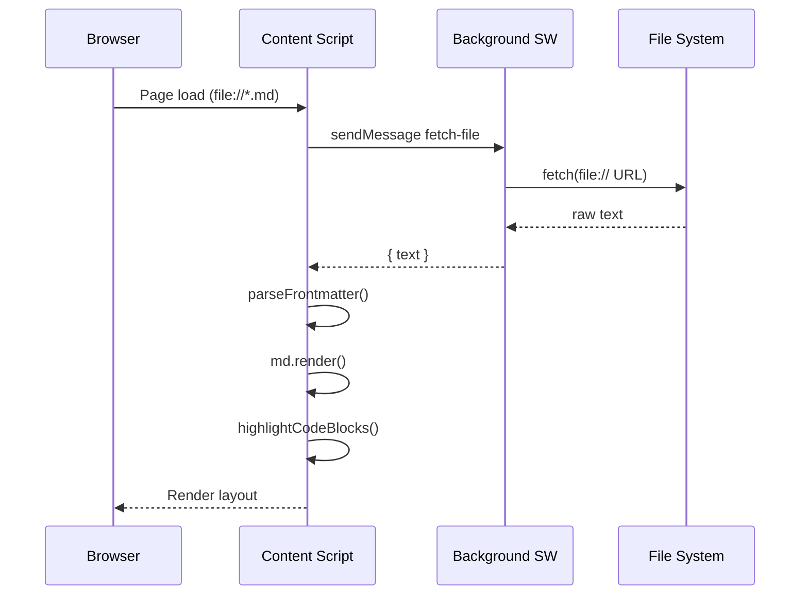
```mermaid
sequenceDiagram
    participant Browser
    participant ContentScript as Content Script
    participant Background as Background SW
    participant FileSystem as File System

    Browser->>ContentScript: Page load (file://*.md)
    ContentScript->>Background: sendMessage fetch-file
    Background->>FileSystem: fetch(file:// URL)
    FileSystem-->>Background: raw text
    Background-->>ContentScript: { text }
    ContentScript->>ContentScript: parseFrontmatter()
    ContentScript->>ContentScript: md.render()
    ContentScript->>ContentScript: highlightCodeBlocks()
    ContentScript-->>Browser: Render layout
```

## State Diagram

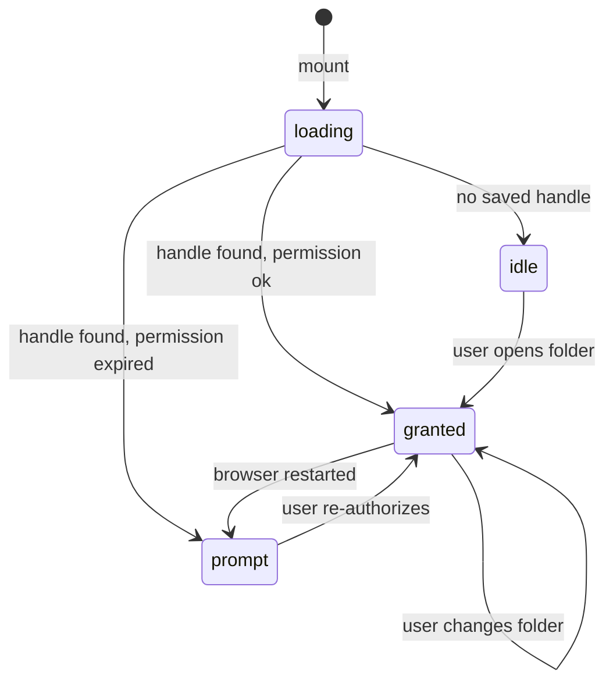
```mermaid
stateDiagram-v2
    [*] --> loading: mount
    loading --> idle: no saved handle
    loading --> prompt: handle found, permission expired
    loading --> granted: handle found, permission ok

    idle --> granted: user opens folder
    prompt --> granted: user re-authorizes
    granted --> prompt: browser restarted

    granted --> granted: user changes folder
```

## Entity Relationship

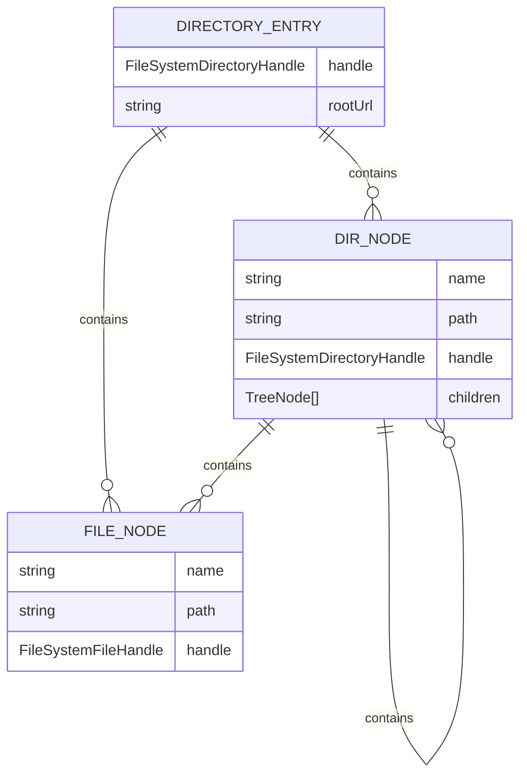
```mermaid
erDiagram
    DIRECTORY_ENTRY {
        FileSystemDirectoryHandle handle
        string rootUrl
    }
    FILE_NODE {
        string name
        string path
        FileSystemFileHandle handle
    }
    DIR_NODE {
        string name
        string path
        FileSystemDirectoryHandle handle
        TreeNode[] children
    }
    DIRECTORY_ENTRY ||--o{ FILE_NODE : contains
    DIRECTORY_ENTRY ||--o{ DIR_NODE : contains
    DIR_NODE ||--o{ FILE_NODE : contains
    DIR_NODE ||--o{ DIR_NODE : contains
```

## Git Graph

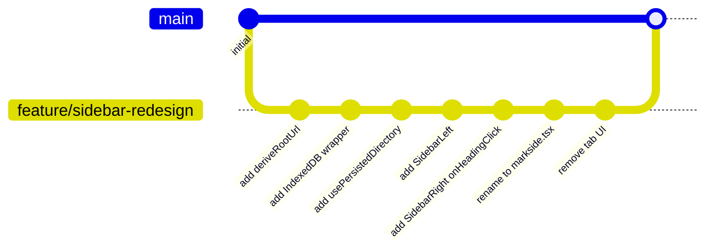
```mermaid
gitGraph
    commit id: "initial"
    branch feature/sidebar-redesign
    checkout feature/sidebar-redesign
    commit id: "add deriveRootUrl"
    commit id: "add IndexedDB wrapper"
    commit id: "add usePersistedDirectory"
    commit id: "add SidebarLeft"
    commit id: "add SidebarRight onHeadingClick"
    commit id: "rename to markside.tsx"
    commit id: "remove tab UI"
    checkout main
    merge feature/sidebar-redesign
```

## Pie Chart

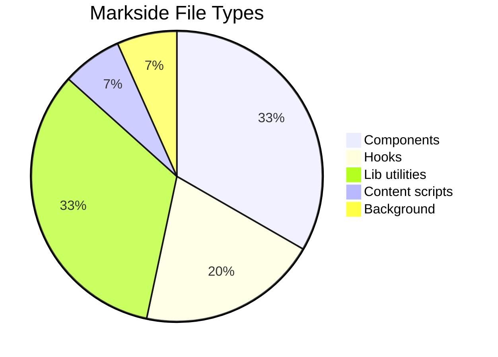
```mermaid
pie title Markside File Types
    "Components" : 5
    "Hooks" : 3
    "Lib utilities" : 5
    "Content scripts" : 1
    "Background" : 1
```

## Class Diagram

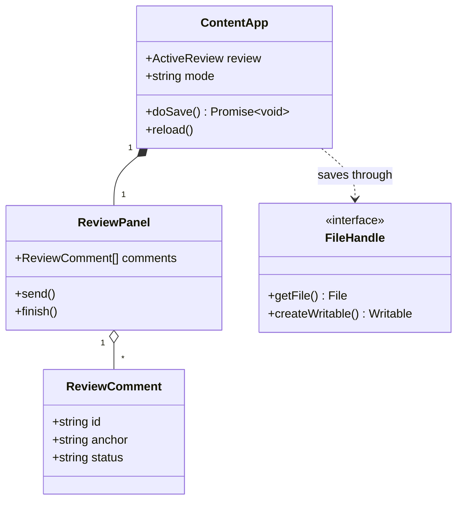
```mermaid
classDiagram
    class ContentApp {
        +ActiveReview review
        +string mode
        +doSave() Promise~void~
        +reload()
    }
    class ReviewPanel {
        +ReviewComment[] comments
        +send()
        +finish()
    }
    class ReviewComment {
        +string id
        +string anchor
        +string status
    }
    class FileHandle {
        <<interface>>
        +getFile() File
        +createWritable() Writable
    }
    ContentApp "1" *-- "1" ReviewPanel
    ReviewPanel "1" o-- "*" ReviewComment
    ContentApp ..> FileHandle : saves through
```

## Gantt Chart

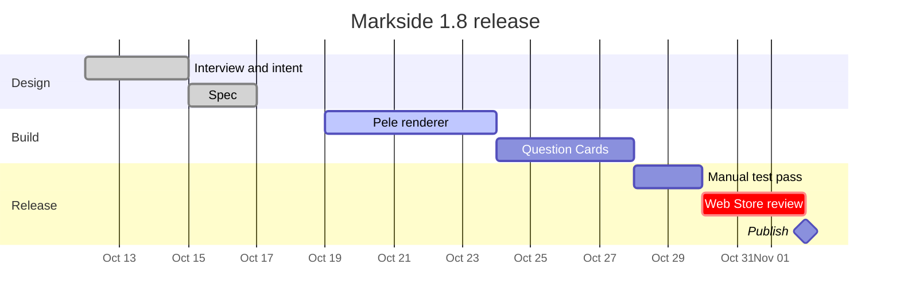
```mermaid
gantt
    title Markside 1.8 release
    dateFormat YYYY-MM-DD
    axisFormat %b %d
    section Design
        Interview and intent      :done,    d1, 2026-10-12, 3d
        Spec                      :done,    d2, after d1, 2d
    section Build
        Pele renderer             :active,  b1, 2026-10-19, 5d
        Question Cards            :         b2, after b1, 4d
    section Release
        Manual test pass          :         r1, after b2, 2d
        Web Store review          :crit,    r2, after r1, 3d
        Publish                   :milestone, after r2, 0d
```

## User Journey

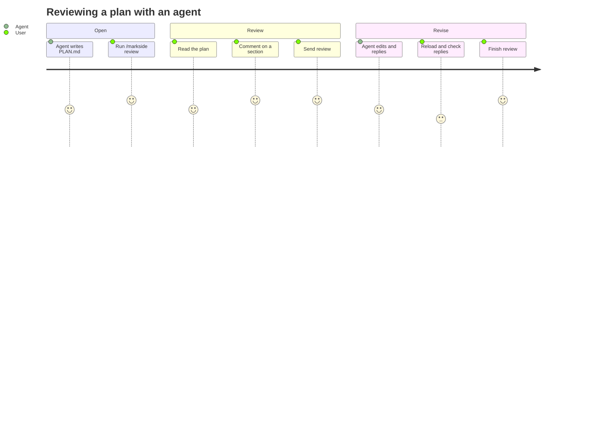
```mermaid
journey
    title Reviewing a plan with an agent
    section Open
        Agent writes PLAN.md: 4: Agent
        Run /markside review: 5: User
    section Review
        Read the plan: 4: User
        Comment on a section: 5: User
        Send review: 5: User
    section Revise
        Agent edits and replies: 4: Agent
        Reload and check replies: 3: User
        Finish review: 5: User
```

## Mindmap

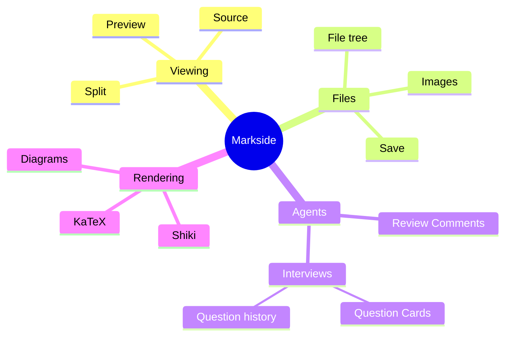
```mermaid
mindmap
  root((Markside))
    Viewing
      Preview
      Source
      Split
    Files
      File tree
      Images
      Save
    Agents
      Review Comments
      Interviews
        Question Cards
        Question history
    Rendering
      Shiki
      KaTeX
      Diagrams
```

## Timeline

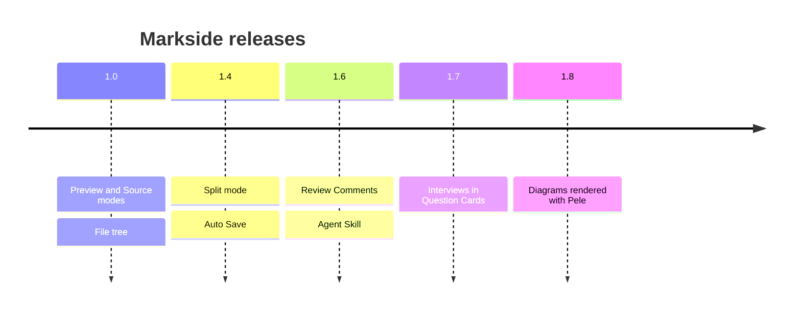
```mermaid
timeline
    title Markside releases
    1.0 : Preview and Source modes
        : File tree
    1.4 : Split mode
        : Auto Save
    1.6 : Review Comments
        : Agent Skill
    1.7 : Interviews in Question Cards
    1.8 : Diagrams rendered with Pele
```

## Quadrant Chart

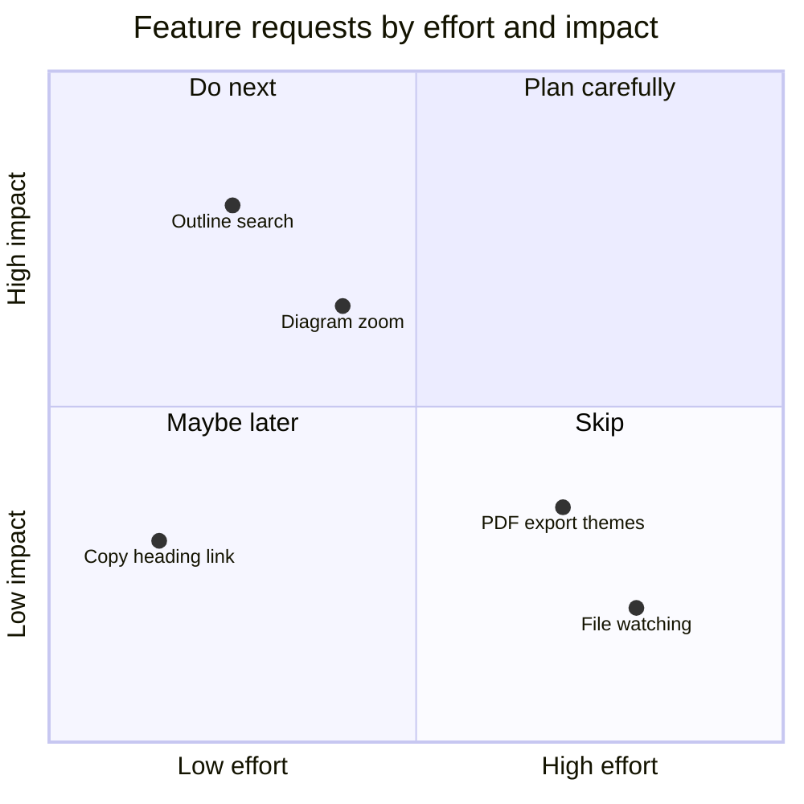
```mermaid
quadrantChart
    title Feature requests by effort and impact
    x-axis Low effort --> High effort
    y-axis Low impact --> High impact
    quadrant-1 Plan carefully
    quadrant-2 Do next
    quadrant-3 Maybe later
    quadrant-4 Skip
    Outline search: [0.25, 0.8]
    Diagram zoom: [0.4, 0.65]
    PDF export themes: [0.7, 0.35]
    File watching: [0.8, 0.2]
    Copy heading link: [0.15, 0.3]
```

## XY Chart

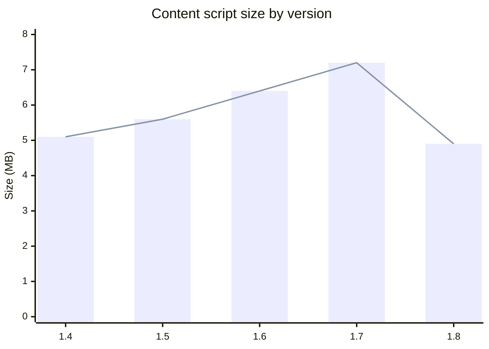
```mermaid
xychart-beta
    title "Content script size by version"
    x-axis [1.4, 1.5, 1.6, 1.7, 1.8]
    y-axis "Size (MB)" 0 --> 8
    bar [5.1, 5.6, 6.4, 7.2, 4.9]
    line [5.1, 5.6, 6.4, 7.2, 4.9]
```

## Sankey

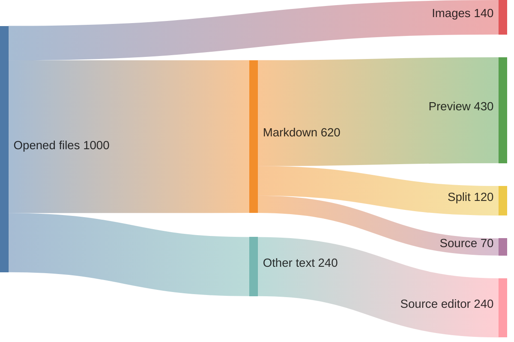
```mermaid
sankey-beta
Opened files,Markdown,620
Opened files,Images,140
Opened files,Other text,240
Markdown,Preview,430
Markdown,Split,120
Markdown,Source,70
Other text,Source editor,240
```

## Requirement Diagram

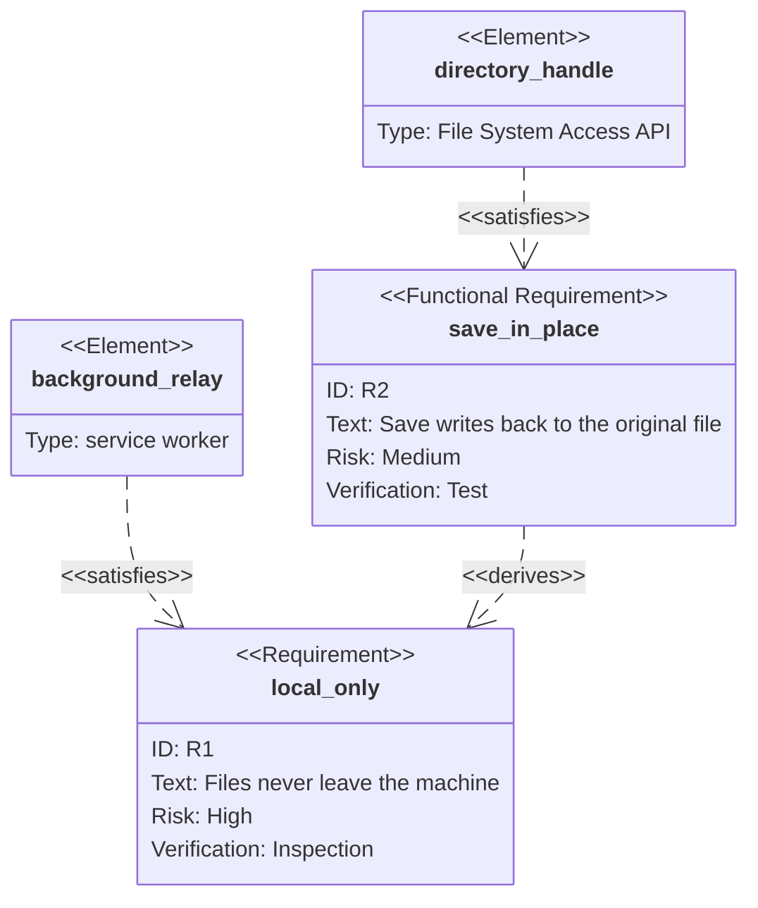
```mermaid
requirementDiagram
    requirement local_only {
        id: R1
        text: Files never leave the machine
        risk: high
        verifymethod: inspection
    }
    functionalRequirement save_in_place {
        id: R2
        text: Save writes back to the original file
        risk: medium
        verifymethod: test
    }
    element background_relay {
        type: service worker
    }
    element directory_handle {
        type: File System Access API
    }
    background_relay - satisfies -> local_only
    directory_handle - satisfies -> save_in_place
    save_in_place - derives -> local_only
```

## C4 Context

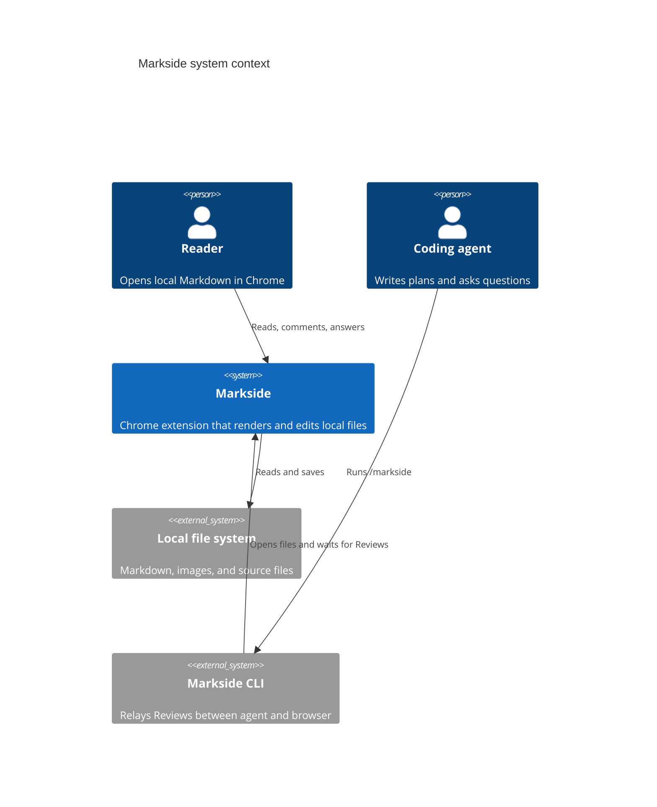
```mermaid
C4Context
    title Markside system context
    Person(user, "Reader", "Opens local Markdown in Chrome")
    Person(agent, "Coding agent", "Writes plans and asks questions")
    System(markside, "Markside", "Chrome extension that renders and edits local files")
    System_Ext(fs, "Local file system", "Markdown, images, and source files")
    System_Ext(cli, "Markside CLI", "Relays Reviews between agent and browser")
    Rel(user, markside, "Reads, comments, answers")
    Rel(markside, fs, "Reads and saves")
    Rel(agent, cli, "Runs /markside")
    Rel(cli, markside, "Opens files and waits for Reviews")
```

## Block Diagram

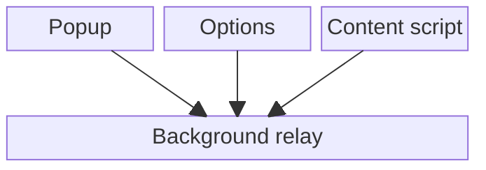
```mermaid
block-beta
    columns 3
    popup["Popup"] options["Options"] content["Content script"]
    space:3
    bg["Background relay"]:3
    popup --> bg
    content --> bg
    options --> bg
```

## Packet

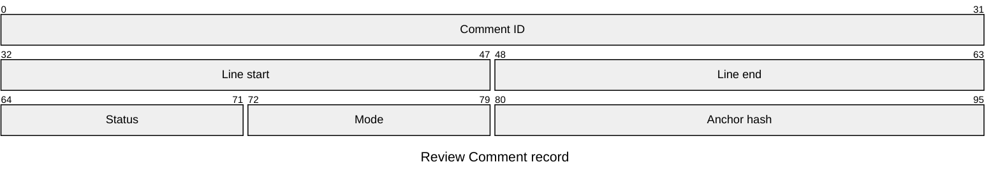
```mermaid
packet-beta
    title Review Comment record
    0-31: "Comment ID"
    32-47: "Line start"
    48-63: "Line end"
    64-71: "Status"
    72-79: "Mode"
    80-95: "Anchor hash"
```

## Kanban

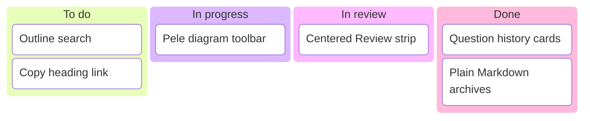
```mermaid
kanban
    todo[To do]
        t1[Outline search]
        t2[Copy heading link]
    doing[In progress]
        d1[Pele diagram toolbar]
    review[In review]
        r1[Centered Review strip]
    done[Done]
        f1[Question history cards]
        f2[Plain Markdown archives]
```

## Architecture

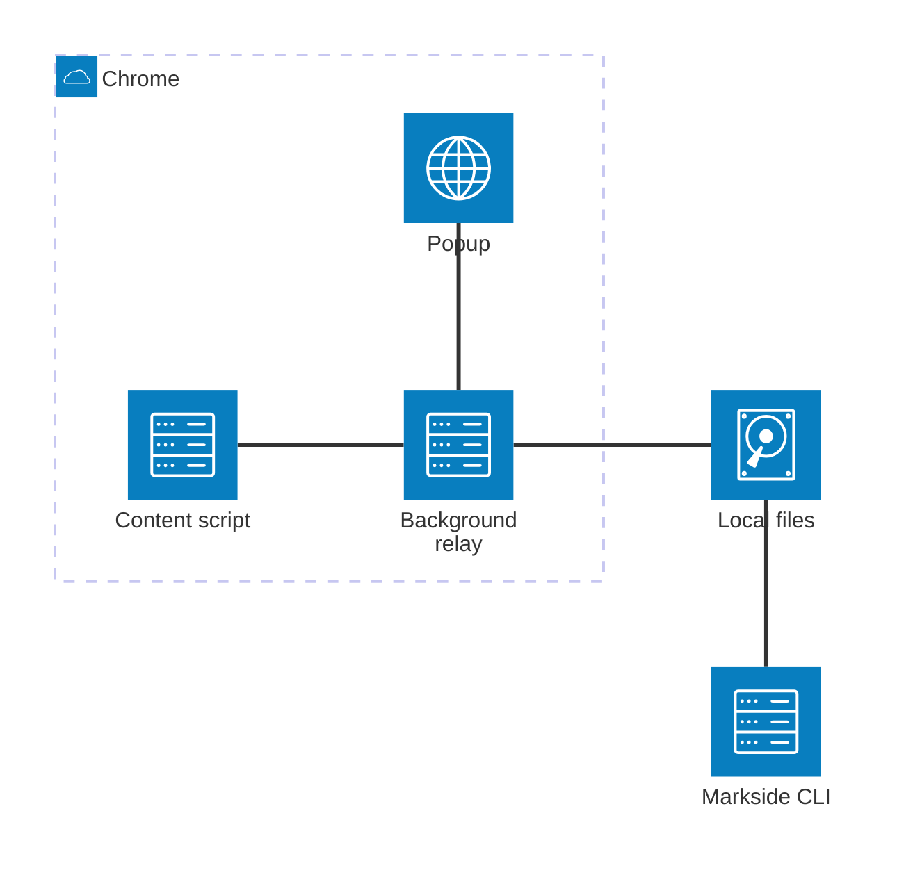
```mermaid
architecture-beta
    group chrome(cloud)[Chrome]
    service content(server)[Content script] in chrome
    service background(server)[Background relay] in chrome
    service popup(internet)[Popup] in chrome
    service disk(disk)[Local files]
    service cli(server)[Markside CLI]

    content:R -- L:background
    popup:B -- T:background
    background:R -- L:disk
    cli:T -- B:disk
```

## Radar

```mermaid
radar-beta
    title Viewer comparison
    axis speed["Speed"], editing["Editing"], review["Review"], diagrams["Diagrams"], privacy["Privacy"]
    curve markside["Markside"]{5, 4, 5, 4, 5}
    curve plain["Plain viewer"]{4, 1, 1, 2, 5}
    max 5
    min 0
```

## Treemap

```mermaid
treemap-beta
"Content script"
    "Rendering"
        "Markdown": 18
        "Shiki": 30
        "Diagrams": 22
    "Editor"
        "CodeMirror": 20
    "UI": 10
```

## Swimlane

```mermaid
swimlane-beta LR
  subgraph Agent
    write[Write PLAN.md]
    revise[Edit and reply]
  end

  subgraph CLI
    open[Open in Chrome]
    wait[Wait for Review]
  end

  subgraph Reviewer
    comment[Comment on sections]
    finish[Finish review]
  end

  write --> open --> comment
  comment -->|Send review| wait
  wait --> revise --> comment
  comment -->|Looks good| finish
```

## Agent Flow

```mermaid
agentflow-beta TB
  flow ask["Ask"]
    plan["Read the plan"]@{ shape: input }
    write["Write questions"]@{ shape: task }
    plan --> write
  end

  flow answer["Answer"]
    cards["Question Cards"]@{ shape: task }
    send["Send review"]@{ shape: action }
    cards --> send
  end

  flow record["Record"]
    archive["Archive decisions"]@{ shape: task }
  end

  write --> cards
  send --> archive
```

## Tree View

```mermaid
treeView-beta
    markside/
        contents/
            markside.tsx ## content-script bootstrap
        components/
            content-app.tsx :::highlight ## state and orchestration
            review-panel.tsx
        lib/
            markdown.ts
            mermaid.ts
        background.ts ## local-file fetch relay
        popup.tsx
```

## Venn

```mermaid
venn-beta
  set A["Viewer"]
    text A1["Preview"]
    text A2["File tree"]
  set B["Editor"]
    text B1["Source mode"]
    text B2["Auto Save"]
  union A,B["Split mode"]
    text AB1["Live preview"]
```

## Ishikawa

```mermaid
ishikawa-beta
    Diagram renders slowly
    Bundle
        Large renderer library
        Unused diagram types
    Document
        Many diagrams
        Very large flowcharts
    Browser
        Fonts load late
        Theme switch redraws
    Environment
        Low-power laptop
```

## Railroad

```mermaid
railroad-beta
title Question heading

heading = sequence(
    terminal("### Q"),
    nonterminal("number"),
    terminal(". "),
    nonterminal("question"),
    optional(terminal("?"))
) ;
number = oneOrMore(nonterminal("digit")) ;
```

## Cynefin

```mermaid
cynefin-beta
  title Triage for incoming bugs

  complex
    "Flaky file permission"

  complicated
    "Large-file slowness"

  clear
    "Typo in Settings"

  chaotic
    "Saves corrupt files"

  chaotic --> complex : "Hotfix shipped"
  complex --> complicated : "Cause found"
  complicated --> clear : "Fix documented"
```

## Wardley Map

```mermaid
wardley-beta
title Markside value chain

anchor Reader [0.95, 0.70]
component Rendered document [0.82, 0.62]
component Review loop [0.70, 0.30]
component Markdown parser [0.55, 0.85]
component Diagram renderer [0.45, 0.55]
component Chrome extension APIs [0.20, 0.80]

Reader -> Rendered document
Reader -> Review loop
Rendered document -> Markdown parser
Rendered document -> Diagram renderer
Review loop -> Chrome extension APIs
Markdown parser -> Chrome extension APIs

evolve Diagram renderer 0.75

note "Pele moves diagrams toward a commodity" [0.35, 0.62]
```

## Event Modeling

```mermaid
eventmodeling

timeframe 01 ui ReviewPanel
timeframe 02 command SendReview [[SendReview01]]
timeframe 03 event ReviewSent [[ReviewSent]]
timeframe 04 command FinishReview [[FinishReview01]]
timeframe 05 event ReviewFinished [[ReviewFinished]]

data SendReview01 {
  file: 'PLAN.md'
  comments: 2
}

data FinishReview01 {
  file: 'PLAN.md'
}

data ReviewSent {
  file: string
  comments: number
}

data ReviewFinished {
  file: string
}
```

## Use Case

```mermaid
usecase-beta
  actor Reader
  actor Agent
  Reader --> "Open a Markdown file"
  Reader --> "Comment on a section"
  Reader --> "Answer interview questions"
  Agent --> "Answer interview questions"
```

## Animated Edges

Give an edge an ID with `id@-->`, then set `animate` on it. `animation` accepts `slow` or `fast` and defaults to `fast`.

```mermaid
flowchart LR
  A("Client") r1@-->|Request| B["Ingress"]
  B r2@--> C["Service"]
  C r3@-->|Query| D[("Database")]
  r1@{ animate: true, animation: slow }
  r2@{ animate: true }
  r3@{ animate: true, animation: fast }
```
